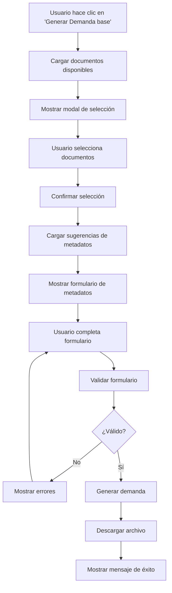

# 📋 Guía del Formulario de Metadatos para Demandas

## 🎯 ¿Qué es el Formulario de Metadatos?

El **Formulario de Metadatos** es una nueva funcionalidad que permite a los usuarios personalizar completamente las demandas antes de generarlas, proporcionando una interfaz intuitiva para completar todos los datos necesarios.

## 🚀 Características Principales

### ✅ **Selección Inteligente de Documentos**
- **Modal de selección visual** con tarjetas interactivas
- **Detección automática de instancia** (TS, TSJ, Otro)
- **Selección múltiple** con checkboxes
- **Opción "Seleccionar todos"** para mayor comodidad

### ✅ **Formulario Completo de Metadatos**
- **Información del Demandante**: Nombre, DNI, domicilio
- **Información Laboral**: Empresa, profesión, mutua
- **Información de la Demanda**: Grados, base reguladora, indemnización
- **Información del Letrado**: Nombre del representante legal

### ✅ **Validación Robusta**
- **Validación en tiempo real** con feedback visual
- **Campos obligatorios** claramente marcados
- **Mensajes de error** descriptivos
- **Validación HTML5** nativa

### ✅ **Sugerencias Automáticas**
- **Extracción automática** de metadatos de documentos
- **Sugerencias inteligentes** basadas en análisis de contenido
- **Autocompletado** de campos cuando es posible

## 📖 Cómo Usar el Formulario

### Paso 1: Acceder al Formulario
1. Ve a la página de **Análisis Predictivo** (`/analisis-predictivo`)
2. Haz clic en el botón **"Generar Demanda base"**
3. Se abrirá el modal de selección de documentos

### Paso 2: Seleccionar Documentos
1. **Revisa la lista** de documentos disponibles
2. **Observa las etiquetas** de instancia (TS, TSJ, Otro)
3. **Selecciona los documentos** que quieres incluir:
   - Haz clic en las tarjetas para seleccionar/deseleccionar
   - O usa "Seleccionar todos" para incluir todos
4. Haz clic en **"Confirmar Selección"**

### Paso 3: Completar Metadatos
1. **Información del Demandante** (obligatorio):
   - Nombre completo
   - DNI/NIE
   - Domicilio completo

2. **Información Laboral** (opcional):
   - Empresa/Entidad
   - Profesión/Categoría
   - Mutua de Accidentes

3. **Información de la Demanda**:
   - **Grado Principal** (obligatorio): IPT, IPP, IPAB, GCI
   - **Grado Subsidiario** (opcional): Grado alternativo
   - **Base Reguladora**: Monto económico
   - **Indemnización Parcial**: 24, 30, 36 o 42 mensualidades

4. **Información del Letrado** (opcional):
   - Nombre del letrado/abogado

### Paso 4: Revisar Sugerencias
- **Lee las sugerencias** del sistema (si las hay)
- **Ajusta los campos** según las recomendaciones
- **Verifica** que toda la información sea correcta

### Paso 5: Generar Demanda
1. Haz clic en **"Generar Demanda"**
2. **Espera** mientras se procesa (barra de progreso)
3. **Descarga automática** del archivo `.txt`
4. **Mensaje de éxito** confirmando la generación

## 🎨 Interfaz de Usuario

### Modal de Selección de Documentos
```
┌─────────────────────────────────────────┐
│ 📁 Seleccionar Documentos para Demanda  │
├─────────────────────────────────────────┤
│ ☑️ Seleccionar todos los documentos     │
│                                         │
│ ┌─────────────┐ ┌─────────────┐        │
│ │ STS_2384... │ │ TSJ_1234... │        │
│ │ [TS]        │ │ [TSJ]       │        │
│ │ ☑️ Incluir  │ │ ☑️ Incluir  │        │
│ └─────────────┘ └─────────────┘        │
│                                         │
│ [Cancelar] [Confirmar Selección]        │
└─────────────────────────────────────────┘
```

### Formulario de Metadatos
```
┌─────────────────────────────────────────┐
│ 📋 Configurar Metadatos de la Demanda   │
├─────────────────────────────────────────┤
│ 👤 Información del Demandante           │
│ Nombre: [________________] *            │
│ DNI:    [________________] *            │
│ Domicilio: [________________] *         │
│                                         │
│ 💼 Información Laboral                  │
│ Empresa: [________________]             │
│ Profesión: [________________]           │
│                                         │
│ ⚖️ Información de la Demanda            │
│ Grado Principal: [IPT ▼] *             │
│ Base Reguladora: [________________]     │
│                                         │
│ 💡 Sugerencias del Sistema              │
│ PROFESIÓN: Personal de limpieza         │
│ EMPRESA: Empresa Municipal              │
│                                         │
│ [Cancelar] [Generar Demanda]            │
└─────────────────────────────────────────┘
```

## 🔧 Validaciones Implementadas

### Campos Obligatorios
- ✅ **Nombre**: No puede estar vacío
- ✅ **DNI**: No puede estar vacío
- ✅ **Domicilio**: No puede estar vacío
- ✅ **Grado Principal**: Debe seleccionar una opción

### Validaciones de Formato
- ✅ **DNI**: Validación básica de formato
- ✅ **Campos de texto**: Longitud máxima controlada
- ✅ **Selección**: Solo opciones válidas

### Validaciones de Negocio
- ✅ **Documentos**: Al menos uno debe estar seleccionado
- ✅ **Grado Subsidiario**: No puede ser igual al principal
- ✅ **Base Reguladora**: Formato numérico sugerido

## 🎯 Beneficios de la Nueva Funcionalidad

### Para el Usuario
- **🎨 Interfaz intuitiva**: Fácil de usar y entender
- **⚡ Proceso guiado**: Paso a paso sin confusión
- **🔍 Validación en tiempo real**: Errores detectados inmediatamente
- **💡 Sugerencias inteligentes**: Ayuda automática del sistema
- **📱 Responsive**: Funciona en móviles y tablets

### Para el Sistema
- **🛡️ Datos consistentes**: Validación robusta previene errores
- **📊 Metadatos completos**: Información estructurada para análisis
- **🔄 Reutilización**: Datos guardados para futuras demandas
- **📈 Mejora continua**: Feedback para optimizar el sistema

## 🚨 Solución de Problemas

### Problema: "No hay documentos para generar la demanda"
**Solución**: Asegúrate de que hay archivos en la carpeta `/sentencias`

### Problema: "Por favor, selecciona al menos un documento"
**Solución**: Marca al menos un checkbox en la selección de documentos

### Problema: "Por favor, ingresa el nombre completo del demandante"
**Solución**: Completa todos los campos marcados con asterisco (*)

### Problema: El formulario no se valida
**Solución**: Verifica que todos los campos obligatorios estén completos

## 🔄 Flujo Completo



## 📝 Notas Técnicas

### Archivos Modificados
- `templates/formulario_metadatos.html` - Modal del formulario
- `templates/analisis_predictivo.html` - Integración y JavaScript

### APIs Utilizadas
- `GET /api/documentos` - Obtener lista de documentos
- `POST /api/extract/demanda` - Extraer sugerencias de metadatos
- `POST /api/demanda-base/txt` - Generar demanda con metadatos

### Tecnologías
- **Bootstrap 5** - Framework CSS y componentes
- **JavaScript ES6+** - Lógica del frontend
- **HTML5 Validation** - Validación nativa
- **Fetch API** - Comunicación con backend

---

## 🎉 ¡Listo para Usar!

El formulario de metadatos está completamente implementado y listo para mejorar la experiencia de generación de demandas. Los usuarios ahora pueden personalizar completamente sus demandas con una interfaz intuitiva y validación robusta.

**¿Necesitas ayuda?** Revisa la sección de solución de problemas o contacta al equipo de desarrollo.
