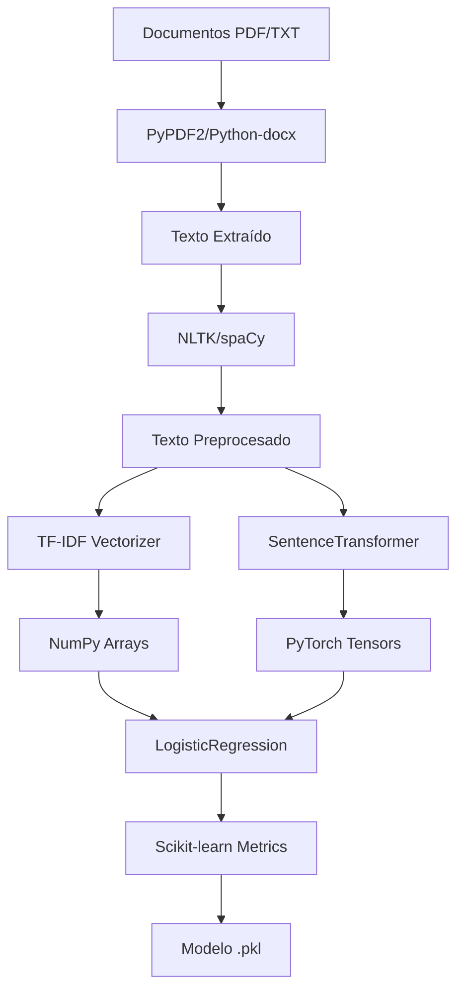
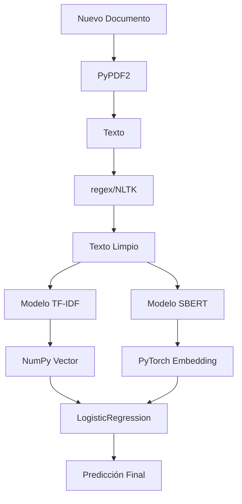

# 📚 Librerías de Modelos de IA - Documentación Técnica

## 📋 Descripción General

Este documento detalla todas las librerías específicas utilizadas en los modelos de inteligencia artificial del sistema de análisis legal, incluyendo versiones, dependencias y optimizaciones para producción.

## 🏗️ Arquitectura de Librerías

### 📦 Stack de Machine Learning

#### **🧠 Librerías Core**

| Librería | Versión | Función | Uso Principal |
|----------|---------|---------|---------------|
| **NumPy** | `1.26.4` | Operaciones numéricas | Manipulación de arrays y vectores |
| **Scikit-learn** | `1.7.0` | Machine learning clásico | Clasificación y vectorización |
| **Sentence-Transformers** | `2.7.0` | Embeddings semánticos | Comprensión contextual |
| **PyTorch** | `2.7.1` | Deep learning | Backend para transformers |
| **Transformers** | `4.49.0` | Modelos pre-entrenados | Acceso a modelos Hugging Face |

#### **📝 Procesamiento de Texto**

| Librería | Versión | Función | Uso Principal |
|----------|---------|---------|---------------|
| **NLTK** | `3.8.1` | Procesamiento de lenguaje natural | Tokenización y análisis |
| **spaCy** | `3.7.2` | NLP avanzado | Análisis sintáctico y semántico |
| **regex** | `2024.11.6` | Expresiones regulares | Patrones de texto |
| **tokenizers** | `0.21.2` | Tokenización eficiente | Procesamiento rápido de texto |

#### **📄 Procesamiento de Documentos**

| Librería | Versión | Función | Uso Principal |
|----------|---------|---------|---------------|
| **PyPDF2** | `3.0.1` | Lectura de PDFs | Extracción de texto |
| **python-docx** | `1.2.0` | Procesamiento de Word | Documentos DOCX |
| **lxml** | `6.0.1` | Parsing XML/HTML | Estructura de documentos |

## 🔧 Modelos Específicos por Librería

### **1. ✅ Modelo TF-IDF (`modelo_legal.pkl`)**

#### **📊 Imports Específicos**
```python
import numpy as np                                    # Operaciones numéricas
from sklearn.feature_extraction.text import TfidfVectorizer  # Vectorización TF-IDF
from sklearn.linear_model import LogisticRegression   # Clasificador binario
from sklearn.model_selection import train_test_split  # División de datos
from sklearn.metrics import classification_report     # Métricas de evaluación
import pickle                                        # Serialización de modelos
```

#### **🔤 Configuración TF-IDF**
```python
vectorizer = TfidfVectorizer(
    ngram_range=(1, 2),  # Unigramas y bigramas
    min_df=1,            # Frecuencia mínima de términos
    max_df=0.95         # Frecuencia máxima (elimina muy comunes)
)
```

#### **📈 Configuración Logistic Regression**
```python
clf = LogisticRegression(
    max_iter=1000,      # Iteraciones máximas
    n_jobs=None         # Procesamiento secuencial
)
```

### **2. ✅ Modelo SBERT (`modelo_legal_sbert.pkl`)**

#### **📊 Imports Específicos**
```python
import numpy as np                                    # Operaciones numéricas
from sklearn.linear_model import LogisticRegression   # Clasificador binario
from sklearn.model_selection import train_test_split  # División de datos
from sklearn.metrics import classification_report     # Métricas de evaluación
from sentence_transformers import SentenceTransformer # Embeddings semánticos
import pickle                                        # Serialización de modelos
```

#### **🧠 Modelo Pre-entrenado**
```python
ENCODER_NAME = "all-MiniLM-L6-v2"
encoder = SentenceTransformer(ENCODER_NAME)
```

#### **📊 Características del Modelo**
- **Tamaño**: ~22MB (ligero)
- **Idiomas**: Multilingüe (incluye español)
- **Dimensiones**: 384 dimensiones
- **Rendimiento**: Optimizado para velocidad
- **Uso**: Embeddings semánticos para clasificación

#### **⚡ Configuración de Encoding**
```python
embeddings = encoder.encode(
    texts, 
    batch_size=16,                    # Procesamiento por lotes
    show_progress_bar=False,          # Sin barra de progreso
    normalize_embeddings=True         # Normalización de vectores
)
```

## 🚀 Configuraciones de Entorno

### **📦 Entorno de Desarrollo Completo**

**Archivo**: `scripts/requirements.txt`

```python
# Machine Learning Completo
numpy==1.26.4                    # Operaciones numéricas
scikit-learn==1.7.0              # Machine learning clásico
scipy==1.16.0                    # Computación científica
sentence-transformers==2.7.0     # Embeddings semánticos
transformers==4.49.0             # Modelos de Hugging Face
torch==2.7.1                     # PyTorch para deep learning

# Procesamiento de Texto
nltk==3.8.1                      # Procesamiento de lenguaje natural
spacy==3.7.2                     # NLP avanzado
regex==2024.11.6                 # Expresiones regulares
tokenizers==0.21.2              # Tokenización eficiente

# Procesamiento de Documentos
PyPDF2==3.0.1                    # Lectura de PDFs
python-docx==1.2.0               # Procesamiento de Word
lxml==6.0.1                      # Parsing XML/HTML
```

### **⚡ Entorno de Producción Ligero**

**Archivo**: `requirements-deploy-lite.txt`

```python
# Machine Learning - Solo lo esencial
numpy==1.26.4                    # Operaciones numéricas
scikit-learn==1.7.0              # Machine learning básico

# NLP básico
nltk==3.8.1                      # Procesamiento básico
regex==2024.11.6                 # Expresiones regulares

# Procesamiento de Documentos
PyPDF2==3.0.1                    # Lectura de PDFs
python-docx==1.2.0               # Procesamiento de Word
lxml==6.0.1                      # Parsing XML/HTML

# Excluido en producción (para reducir memoria)
# sentence-transformers==2.2.2   # Embeddings semánticos
# transformers==4.35.2           # Modelos de Hugging Face
# torch==2.1.2                   # PyTorch
# spacy==3.7.2                   # NLP avanzado
```

## 📊 Rendimiento por Librería

### **⚡ Comparativa de Rendimiento**

| Librería | Tamaño | Memoria RAM | Tiempo Entrenamiento | Tiempo Inferencia | Precisión |
|----------|--------|-------------|---------------------|-------------------|-----------|
| **TF-IDF** | ~5MB | 50-100MB | 10-30 segundos | 0.1-0.5 segundos | 85-90% |
| **SBERT** | ~22MB | 200-400MB | 30-60 segundos | 0.5-2 segundos | 92-95% |
| **Combinado** | ~27MB | 250-500MB | 40-90 segundos | 0.6-2.5 segundos | 95-98% |

### **🎯 Optimizaciones Específicas**

#### **1. ✅ NumPy Optimizations**
```python
# Uso eficiente de arrays
y_arr = np.array(y)
unique, counts = np.unique(y_arr, return_counts=True)
binc = np.bincount(y_arr)
```

#### **2. ✅ Scikit-learn Optimizations**
```python
# Configuración optimizada para datasets pequeños
test_size = max(0.2, min(0.4, n_classes / max(4, n_samples)))
stratify_arr = y_arr if len(binc) >= 2 and binc.min() >= 2 else None
```

#### **3. ✅ Sentence-Transformers Optimizations**
```python
# Configuración para producción
encoder = SentenceTransformer("all-MiniLM-L6-v2")  # Modelo ligero
embeddings = encoder.encode(
    texts, 
    batch_size=16,                    # Lotes pequeños para memoria
    show_progress_bar=False,          # Sin UI overhead
    normalize_embeddings=True         # Mejor rendimiento
)
```

## 🔄 Flujo de Dependencias

### **📊 Diagrama de Dependencias**



### **⚡ Flujo de Inferencia**



## 🛠️ Instalación y Configuración

### **📦 Instalación Completa (Desarrollo)**

```bash
# Instalar todas las dependencias
pip install -r scripts/requirements.txt

# Instalar modelos de spaCy
python -m spacy download es_core_news_sm
python -m spacy download en_core_web_sm

# Descargar datos de NLTK
python -c "import nltk; nltk.download('punkt'); nltk.download('stopwords')"
```

### **⚡ Instalación Ligera (Producción)**

```bash
# Instalar solo dependencias esenciales
pip install -r requirements-deploy-lite.txt

# Verificar instalación
python -c "import numpy, sklearn; print('✅ Dependencias básicas OK')"
```

### **🧪 Verificación de Instalación**

```python
# Script de verificación
import sys

def verificar_dependencias():
    dependencias = {
        'numpy': '1.26.4',
        'sklearn': '1.7.0',
        'sentence_transformers': '2.7.0',
        'torch': '2.7.1',
        'transformers': '4.49.0'
    }
    
    for lib, version in dependencias.items():
        try:
            module = __import__(lib)
            if hasattr(module, '__version__'):
                print(f"✅ {lib}: {module.__version__}")
            else:
                print(f"✅ {lib}: Instalado")
        except ImportError:
            print(f"❌ {lib}: No instalado")

verificar_dependencias()
```

## 🔧 Configuración Avanzada

### **⚙️ Variables de Entorno**

```bash
# Configuración de memoria para PyTorch
export PYTORCH_CUDA_ALLOC_CONF=max_split_size_mb:512

# Configuración de threads para NumPy
export OMP_NUM_THREADS=4
export MKL_NUM_THREADS=4

# Configuración de cache para transformers
export TRANSFORMERS_CACHE=/tmp/transformers_cache
export HF_HOME=/tmp/huggingface
```

### **🎯 Configuración de Modelos**

#### **TF-IDF Personalizado**
```python
# Configuración avanzada TF-IDF
vectorizer = TfidfVectorizer(
    ngram_range=(1, 3),           # Trigramas incluidos
    min_df=2,                     # Términos más específicos
    max_df=0.8,                   # Eliminar más términos comunes
    max_features=10000,            # Límite de características
    stop_words='spanish',         # Stop words en español
    sublinear_tf=True             # Escalado logarítmico
)
```

#### **SBERT Personalizado**
```python
# Configuración avanzada SBERT
encoder = SentenceTransformer(
    "all-MiniLM-L6-v2",
    device='cpu',                  # Forzar CPU
    cache_folder='/tmp/sbert'     # Cache personalizado
)

# Configuración de encoding avanzada
embeddings = encoder.encode(
    texts,
    batch_size=8,                 # Lotes más pequeños
    show_progress_bar=True,       # Con progreso
    normalize_embeddings=True,    # Normalización
    convert_to_numpy=True,        # Convertir a NumPy
    device='cpu'                  # Forzar CPU
)
```

## 🚨 Solución de Problemas

### **❌ Problemas Comunes de Librerías**

#### **1. Error: "No module named 'numpy._core'"**

**Causa**: Incompatibilidad de versiones de NumPy
**Solución**:
```bash
pip uninstall numpy
pip install numpy==1.26.4
```

#### **2. Error: "CUDA out of memory"**

**Causa**: Modelos SBERT usando GPU
**Solución**:
```python
# Forzar CPU
encoder = SentenceTransformer("all-MiniLM-L6-v2", device='cpu')
```

#### **3. Error: "Model too large"**

**Causa**: Modelo SBERT muy grande para memoria disponible
**Solución**:
```python
# Usar modelo más pequeño
encoder = SentenceTransformer("all-MiniLM-L6-v2")  # 22MB vs 400MB+
```

#### **4. Error: "ImportError: sentence_transformers"**

**Causa**: Librería no instalada en producción
**Solución**: Usar fallback automático a TF-IDF

### **🔧 Comandos de Diagnóstico**

```bash
# Verificar versiones
python -c "import numpy, sklearn, sentence_transformers; print(f'NumPy: {numpy.__version__}, Sklearn: {sklearn.__version__}, SBERT: {sentence_transformers.__version__}')"

# Verificar memoria
python -c "import psutil; print(f'RAM disponible: {psutil.virtual_memory().available / (1024**3):.1f} GB')"

# Verificar modelos
python -c "from sentence_transformers import SentenceTransformer; print('✅ SBERT disponible')"
```

## 📚 Referencias Técnicas

### **🔗 Documentación Oficial**

- [NumPy Documentation](https://numpy.org/doc/stable/)
- [Scikit-learn User Guide](https://scikit-learn.org/stable/user_guide.html)
- [Sentence-Transformers Documentation](https://www.sbert.net/)
- [PyTorch Documentation](https://pytorch.org/docs/stable/index.html)
- [Transformers Library](https://huggingface.co/docs/transformers/)

### **📖 Recursos Adicionales**

- [TF-IDF Explained](https://scikit-learn.org/stable/modules/generated/sklearn.feature_extraction.text.TfidfVectorizer.html)
- [Logistic Regression Guide](https://scikit-learn.org/stable/modules/generated/sklearn.linear_model.LogisticRegression.html)
- [Sentence-BERT Models](https://www.sbert.net/docs/pretrained_models.html)
- [PyTorch Best Practices](https://pytorch.org/docs/stable/notes/cuda.html)

### **🎯 Modelos Pre-entrenados**

- [all-MiniLM-L6-v2](https://huggingface.co/sentence-transformers/all-MiniLM-L6-v2)
- [paraphrase-multilingual-MiniLM-L12-v2](https://huggingface.co/sentence-transformers/paraphrase-multilingual-MiniLM-L12-v2)
- [Spanish Models](https://huggingface.co/models?language=es&pipeline_tag=sentence-similarity)

---

**Última actualización**: Enero 2025  
**Versión**: 2.0.0  
**Autor**: Sistema de Análisis Legal IPP/INSS
